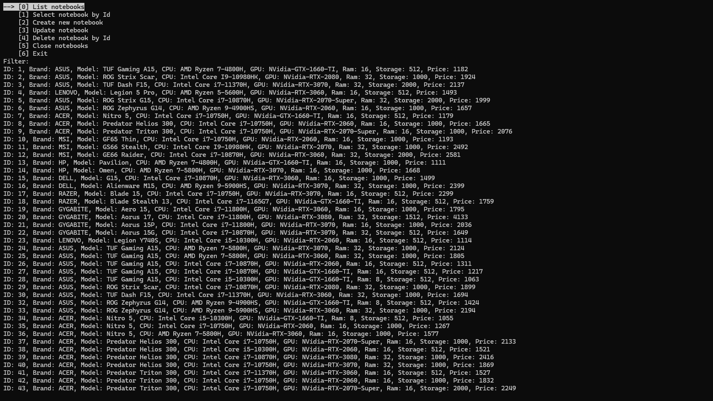
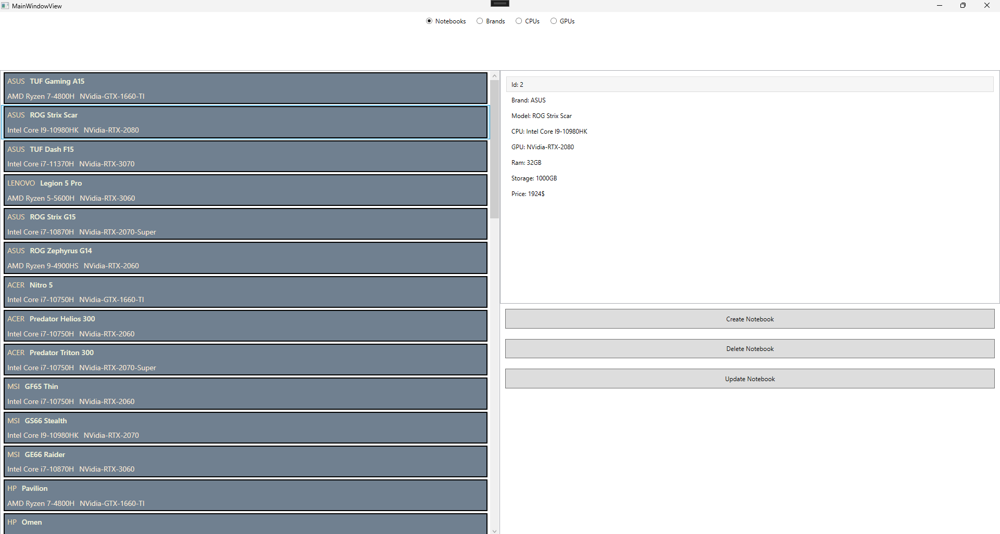
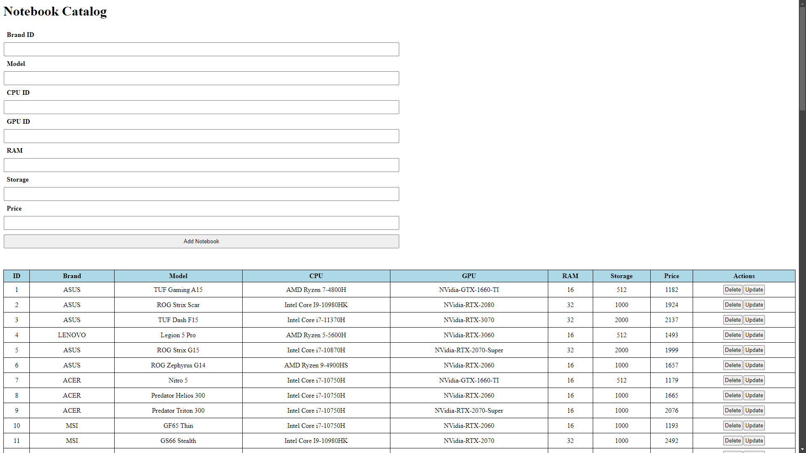

# Notebook Invenotry Management Application

This application is a simple inventory management system for notebooks and their components that allows users to view, add, update and delete items from an inventory.

The application is built using C#, JavaScript, and HTML/CSS. The backend is built using ASP.NET Core, Entity Framework Core with a Service-based Database, while the front end allows 3 different ways to interact with the application. It offers a simple console-, a desktop WPF-, and a web client, solving communication between the front end and the backend using SignalR.

The following categories of items can be managed in the inventory: Notebooks, Brands GPUs, CPUs

## Features:

### General features
	- List items in inventory by category
	- Add items to inventory
	- Update items in inventory
	- Delete items from inventory

### Only console client specific features
	- View individual items by their id
	- Display statistics about the inventory:
		+ Best performance GPU
		+ Average notebook prices by brands
		+ New generation notebooks
		+ Most popular CPUs
		+ High-end notebooks
		+ Min. and max. price by notebook models
	- Filtering for menu options

## Usage:
To choose between the different clients (.Client/.WpfClient/.JSClient), the startup projects must be set in the solution properties. In each case it is important to start both the .Endpoint and the Client project.

### Console Client:
You can select an action by using the menu item numbers, or by navigating the corresponding option with the arrow keys in the menu and hitting enter. An item can be deleted or updated by their id, updating and creating a new item will ask you to input the required fields one-by-one.

### Wpf Client:
You can select from the item categories on the top of the window, and the items will be displayed in the list below. Click on an item to check details or make changes to it. You can add new items by clicking the "Add" button. In a new window appearing, you can input the (new) item's details.

### JS Client:
The web client is a simple page with a table for each category displaying the items in the inventory. You can update items by clicking the "Update" button in the row of the item you want to update, which will open a form to input the new item's details. You can also delete items by clicking the "Delete" button right next to the "Update" button. For adding a new item, there is an already available form by each category table, where you can input the new item's details.

